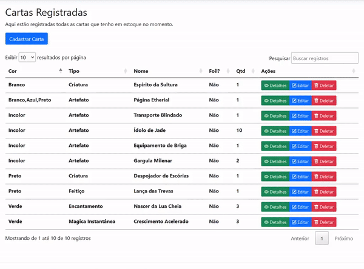

<h1 align="center"> Catálogo de Cartas </h1>

Projeto pessoal MVC, feito para por em prática os conhecimentos adquiridos.

  <a href="#-projeto">Projeto</a>&nbsp;&nbsp;&nbsp;|&nbsp;&nbsp;&nbsp;
  <a href="#%EF%B8%8F-tecnologias">Tecnologias</a>&nbsp;&nbsp;&nbsp;|&nbsp;&nbsp;&nbsp;
  <a href="#%EF%B8%8F-demo">Demo</a>&nbsp;&nbsp;&nbsp;|&nbsp;&nbsp;&nbsp;
    <a href="#%EF%B8%8F-Roadmap">Roadmap</a>

## 💻 Projeto

A motivação que levou ao desenvolvimento desse projeto, foi para realizar o cadastro de todos as cartas de magic que possuo, para futuramente vender. É um projeto bem simples com somente os campos necessários para a rápida identificação das cartas e a possibilidade de realizar a exportação desses dados.

## 🏗️ Tecnologias

Esse projeto foi desenvolvido com as seguintes tecnologias:

- C#;
- .NET 6.0;
- Entity Framework;
- Bootstrap;
- Microsoft SQL Server

## ⚙️ DEMO

O programa possui conexão com o banco sql server, paginação, validação e a possibilidade do usuário informar uma arte personalizada da carta.

